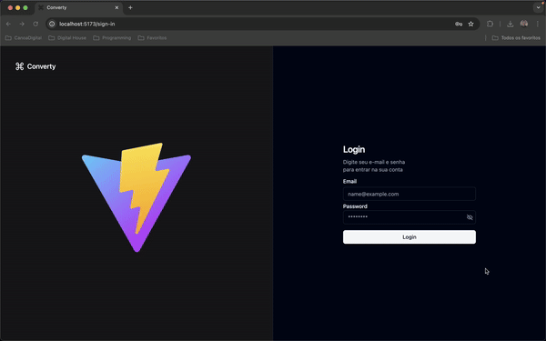

# Converty APP

Converty APP is a tool designed to streamline the conversion of Minha CDN log files into the Agora format with ease. By connecting to the Converty API, it provides an intuitive interface for users to perform conversions efficiently.

## Features

The app includes the following key features:

- **Dashboard Overview**: The homepage displays system-wide statistics, including the total number of logs received in the Minha CDN format and the total number of conversions performed.
- **Log Conversion Page**: Users can easily convert log files from the Minha CDN format to the Agora format. This page provides:
An input field for the URL of the Minha CDN log.
A display area to show the received log.
A section to view the converted log in Agora format.
An option to download the converted log as a .txt file.


## Techs

- [React](https://react.dev) - Frontend framework
- [Firebase](https://firebase.google.com) - Managed infrastructure
- [Typescript](https://www.typescriptlang.org) - Typed JavaScript for better development experience
- [Vite](https://vitejs.dev) - Frontend tooling
- [ESLint](https://eslint.org) - Code quality and formatting
- [Docker](https://www.docker.com) - Containerization for consistent environments

### Prerequisites

Make sure you have the following dependencies installed on your system:

```sh
Docker >= 23.0.5
Docker Compose >= 2.17.3
```

## Project Setup

1. Clone this repository.
2. Copy the `.env.example` file to `.env`

```sh
cp .env.example .env
```

## Running The Application

Start the development server using Docker Compose.

```sh
docker compose up
```

The application will be running in development mode by default. Open your [browser](http://localhost:5173) to see it.

## Testing The Application

Use the following credentials when prompted:

```sh
email: admin@itaas.com
password: brBKX8K5v2Qh1Ar
```

### Type-Check, Compile and Minify for Production

To prepare the project for production, run:

```sh
docker exec -it converty-app npm run build
```

## Demo


